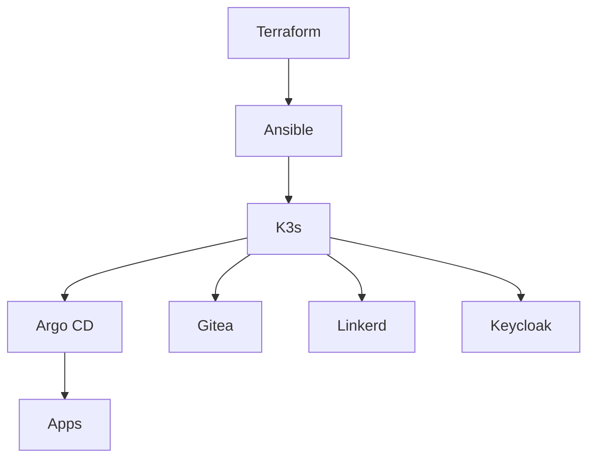
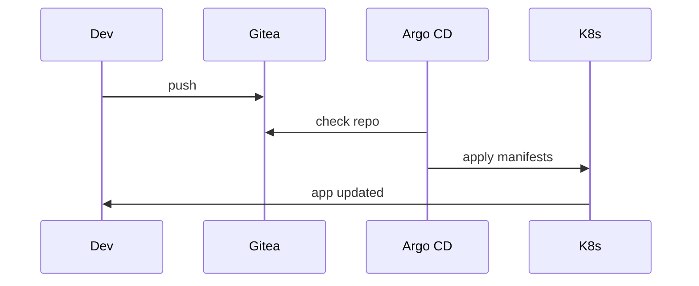
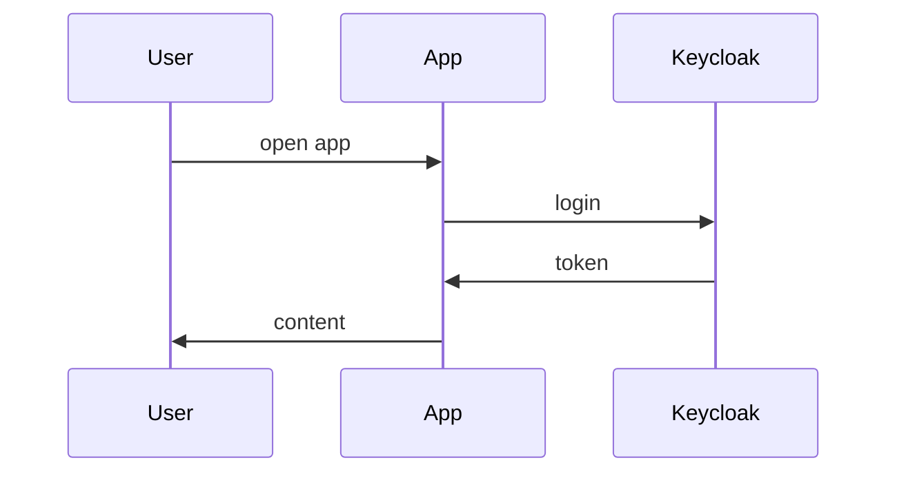

# K3s Lab

> *A complete Kubernetes lab with GitOps, Service Mesh, and Authentication*
This repo holds a small Kubernetes lab that runs fully offline. It uses K3s on two VMs, a local Gitea for Git, Argo CD for GitOps, Linkerd for the service mesh, and Keycloak for auth.

Day 12 was about writing the story and the docs. This README keeps it simple and to the point.

## Procedure
This project is a step-by-step journey into modern DevOps. It starts with a simple K3s cluster and grows into a full platform that includes things like:

- **Zero-Trust Security** with mTLS and OIDC authentication
- **GitOps Pipeline** with ArgoCD and automated deployments  
- **Service Mesh** with Linkerd for advanced networking
- **Observability** with real-time metrics and dashboards
- **CI/CD** with Gitea Actions and automated testing

## Architecture Overview
## Architecture (short version)



##  What You'll Build

### Core Infrastructure
- **K3s Cluster**: Lightweight Kubernetes on Multipass VMs
- **Terraform**: Infrastructure as Code for VM provisioning
- **Ansible**: Configuration management and automation

### Platform Services
- **ArgoCD**: GitOps continuous deployment
- **Linkerd**: Service mesh with mTLS and observability
- **Keycloak**: Identity and access management
- **Gitea**: Self-hosted Git server with Actions

### Applications
- **Rust API**: Actix-web application with PostgreSQL
- **Hello World**: Test application for GitOps pipeline
- **Guestbook**: Sample application for demonstrations

##  Quick Start

### Prerequisites
- Multipass installed
- Terraform installed
- Ansible installed
- kubectl installed

### 1. Infrastructure Setup
```bash
# Clone the repository
git clone https://github.com/Celine-Coralie-Eni/k3s-lab.git
cd k3s-lab

# Deploy infrastructure
terraform init
terraform plan
terraform apply

# Configure with Ansible
ansible-playbook -i inventory ansible/site.yml
## Pipeline (what happens when you push)



## Auth flow (very basic)



## Infra story: Terraform → Ansible → K3s

- Terraform creates the VMs (idempotent: plan shows no changes on reruns).
- Ansible configures the hosts and installs K3s (idempotent tasks).
- K3s runs the cluster. Platform pieces (Argo CD, Linkerd, Keycloak, Gitea) are applied as YAML.

## Idempotence note (proof in plain words)

- Terraform: a second `terraform apply` reports “no changes”.
- Ansible: a second run reports tasks as “ok” not “changed”.
- Kubernetes: `kubectl apply -f ...` prints “unchanged” on reruns.

## How to reproduce from scratch

Prereqs: Multipass, Terraform, Ansible, kubectl, and a Linux/macOS shell.

1) Create VMs and base setup

```bash
cd terraform
terraform init && terraform apply
```

2) Configure and install K3s

```bash
cd ../ansible
ansible-playbook -i inventory k3s-setup.yml
```

3) Install platform

```bash
kubectl apply -f k8s/argocd/
kubectl apply -f k8s/gitea/
kubectl apply -f k8s/keycloak/
linkerd install | kubectl apply -f -
linkerd viz install | kubectl apply -f -
```

4) App by GitOps

```bash
kubectl apply -f k8s/test-app/argocd-app.yaml
kubectl -n argocd get applications
```

##  GitOps Pipeline Flow
## What’s in here

- terraform/: VM definitions
- ansible/: provisioning and K3s setup
- k8s/: YAML for Argo CD, Gitea, Keycloak, test app
- rust-api/: example Rust service
- scripts/: helper scripts

##  Authentication Flow
## Linkerd in one sentence

Linkerd is a service mesh. We inject a small proxy into app pods so we get mTLS and traffic metrics without changing the app code.

##  Technology Stack
## YAML jokes (short break)

YAML breaks when spaces are wrong. If something fails for no reason, check indentation first.

##  Project Structure

```
k3s-lab/
├──  terraform/           # Infrastructure as Code
│   ├── main.tf
│   ├── variables.tf
│   └── outputs.tf
├──  ansible/             # Configuration management
│   ├── site.yml
│   ├── inventory
│   └── roles/
├──  k8s/                # Kubernetes manifests
│   ├── argocd/           # GitOps platform
│   ├── linkerd/          # Service mesh
│   ├── keycloak/         # Authentication
│   ├── gitea/            # Git server
│   └── test-app/         # Sample applications
├──  rust-api/          # Rust application
│   ├── src/
│   ├── Cargo.toml
│   └── Dockerfile
└──  scripts/           # Automation scripts
    ├── deploy-multipass-infrastructure.sh
    └── verify-setup.sh
```

##  YAML Jokes & Comic Relief
## Day 12: Write Your Epic

- README written in plain language.
- Three mermaid diagrams added: architecture, pipeline, and auth.
- The infra story is spelled out: Terraform → Ansible → K3s.
- Idempotence is explained with simple proofs.
- A how‑to guide shows how to rebuild the lab from zero.

## Troubleshooting quick picks

- Argo CD cannot sync: use the in‑cluster Gitea URL and add a repo secret.
- Ingress has no IP: install MetalLB or use NodePort/port‑forward.
- Linkerd not injecting: `kubectl annotate namespace <ns> linkerd.io/inject=enabled` and restart the deployment.

## License

```yaml
# ✅ This is the way
apiVersion: v1
kind: Pod
metadata:
  name: my-pod  # Properly indented!
spec:
  containers:
  - name: nginx
    image: nginx
```

### Kubernetes Haikus
```
Kubernetes pods
Dancing in the cluster sky
YAML dreams come true
```

```
Service mesh connects
mTLS whispers secrets
Linkerd guards the way
```

##  Idempotence: The Art of Running Twice

This entire setup is **idempotent** - you can run it multiple times and get the same result. Here's the proof:

### Terraform Idempotence
```bash
# First run
terraform apply  # Creates 3 VMs
terraform apply  # No changes needed

# Second run  
terraform apply  # Still no changes needed
```

### Ansible Idempotence
```bash
# First run
ansible-playbook site.yml  # Installs K3s, configures nodes
ansible-playbook site.yml  # No changes needed

# Second run
ansible-playbook site.yml  # Still no changes needed
```

### Kubernetes Idempotence
```bash
# First run
kubectl apply -f k8s/argocd/  # Creates ArgoCD
kubectl apply -f k8s/argocd/  # No changes needed

# Second run
kubectl apply -f k8s/argocd/  # Still no changes needed
```

##  Day-by-Day Journey

| Day | Focus | Achievement |
|-----|-------|-------------|
| **1-2** | Infrastructure | Terraform + Ansible + K3s |
| **3-4** | Application | Rust API with PostgreSQL |
| **5-6** | Testing | Cluster validation and access |
| **7** | Security | Keycloak authentication |
| **8** | Integration | JWT validation in API |
| **9-10** | GitOps | ArgoCD + Gitea pipeline |
| **11** | Service Mesh | Linkerd with mTLS |
| **12** | Documentation | This epic README |

##  Troubleshooting

### Common Issues

**Problem**: `kubectl` can't connect to cluster
```bash
# Solution: Check kubeconfig
export KUBECONFIG=/etc/rancher/k3s/k3s.yaml
kubectl get nodes
```

**Problem**: ArgoCD can't sync from Gitea
```bash
# Solution: Use cluster-internal URLs
repoURL: http://gitea.gitea.svc.cluster.local:3000/gitea-admin/infra.git
```

**Problem**: Linkerd sidecars not injected
```bash
# Solution: Annotate namespace
kubectl annotate namespace test-app linkerd.io/inject=enabled
```

##  Contributing

1. Fork the repository
2. Create a feature branch (`git checkout -b feature/amazing-feature`)
3. Commit your changes (`git commit -m 'Add amazing feature'`)
4. Push to the branch (`git push origin feature/amazing-feature`)
5. Open a Pull Request

##  License

This project is licensed under the MIT License - see the [LICENSE](LICENSE) file for details.

##  Acknowledgments

- **K3s Team** for the lightweight Kubernetes distribution
- **Linkerd Team** for the amazing service mesh
- **ArgoCD Team** for GitOps excellence
- **Keycloak Team** for identity management
- **Rust Community** for the blazing-fast language

## 📞 Support

Having issues? Here are your options:

1. **Check the logs**: `kubectl logs -f deployment/your-app`
2. **Verify connectivity**: `kubectl get pods -A`
3. **Check service mesh**: `linkerd check`
4. **Open an issue**: [GitHub Issues](https://github.com/Celine-Coralie-Eni/k3s-lab/issues)

---

##  Conclusion

You've just built a **production-ready Kubernetes platform** with:
- ✅ **Infrastructure as Code** (Terraform + Ansible)
- ✅ **GitOps Pipeline** (ArgoCD + Gitea)
- ✅ **Service Mesh** (Linkerd + mTLS)
- ✅ **Authentication** (Keycloak + JWT)
- ✅ **Observability** (Linkerd Viz)
- ✅ **High-Performance API** (Rust + Actix-web)

MIT
MIT# touch

<!-- touch to trigger actions -->
