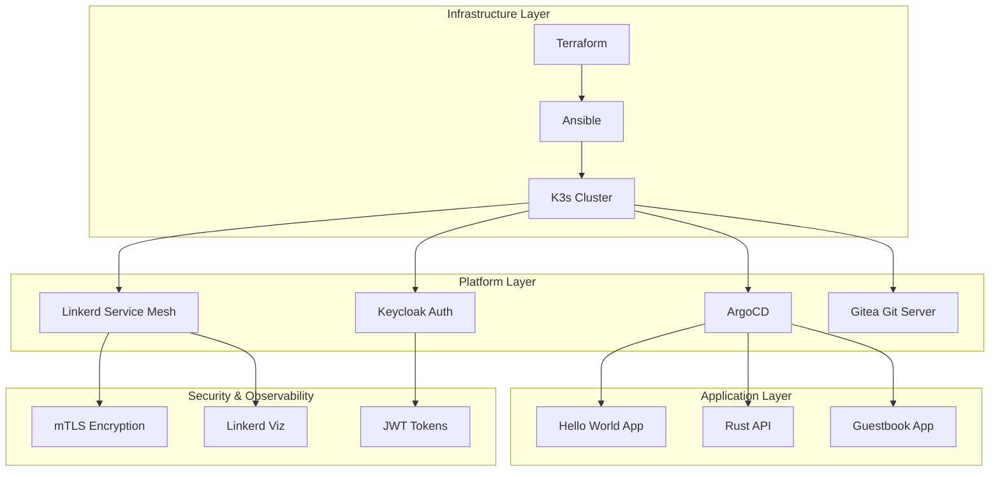
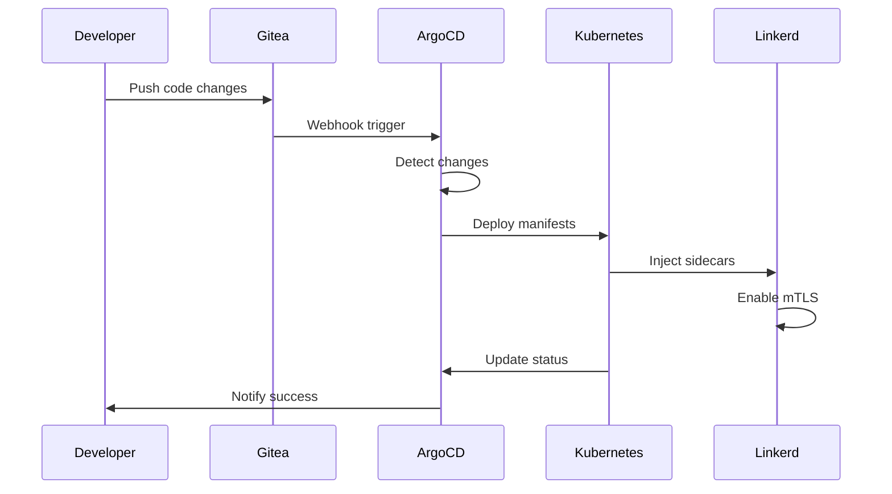
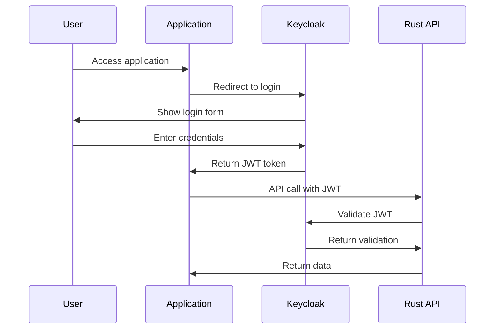

# 🚀 K3s Lab: The Epic Kubernetes Journey

> *A complete Kubernetes lab with GitOps, Service Mesh, and Authentication*

[](https://kubernetes.io/)
[](https://k3s.io/)
[](https://linkerd.io/)
[](https://argoproj.github.io/cd/)
[](https://www.keycloak.org/)

## 📖 The Epic Story

This project is a step-by-step journey into modern DevOps. It starts with a simple K3s cluster and grows into a full platform that includes things like:

- ** Zero-Trust Security** with mTLS and OIDC authentication
- ** GitOps Pipeline** with ArgoCD and automated deployments  
- ** Service Mesh** with Linkerd for advanced networking
- ** Observability** with real-time metrics and dashboards
- ** CI/CD** with Gitea Actions and automated testing

## Architecture Overview



##  What You'll Build

### Core Infrastructure
- **K3s Cluster**: Lightweight Kubernetes on Multipass VMs
- **Terraform**: Infrastructure as Code for VM provisioning
- **Ansible**: Configuration management and automation

### Platform Services
- **ArgoCD**: GitOps continuous deployment
- **Linkerd**: Service mesh with mTLS and observability
- **Keycloak**: Identity and access management
- **Gitea**: Self-hosted Git server with Actions

### Applications
- **Rust API**: Actix-web application with PostgreSQL
- **Hello World**: Test application for GitOps pipeline
- **Guestbook**: Sample application for demonstrations

##  Quick Start

### Prerequisites
- Multipass installed
- Terraform installed
- Ansible installed
- kubectl installed

### 1. Infrastructure Setup
```bash
# Clone the repository
git clone https://github.com/Celine-Coralie-Eni/k3s-lab.git
cd k3s-lab

# Deploy infrastructure
terraform init
terraform plan
terraform apply

# Configure with Ansible
ansible-playbook -i inventory ansible/site.yml
```

### 2. Platform Deployment
```bash
# Deploy ArgoCD
kubectl apply -f k8s/argocd/

# Deploy Linkerd
linkerd install | kubectl apply -f -
linkerd viz install | kubectl apply -f -

# Deploy Keycloak
kubectl apply -f k8s/keycloak/

# Deploy Gitea
kubectl apply -f k8s/gitea/
```

### 3. Application Deployment
```bash
# Deploy via GitOps
kubectl apply -f k8s/test-app/argocd-app.yaml

# Watch the magic happen
kubectl get applications -n argocd
```

##  GitOps Pipeline Flow



##  Authentication Flow



##  Technology Stack

| Component | Technology | Purpose |
|-----------|------------|---------|
| **Orchestration** | K3s | Lightweight Kubernetes |
| **Infrastructure** | Terraform | IaC for VM provisioning |
| **Configuration** | Ansible | Automation and setup |
| **GitOps** | ArgoCD | Continuous deployment |
| **Service Mesh** | Linkerd | mTLS and observability |
| **Authentication** | Keycloak | Identity management |
| **Git Server** | Gitea | Self-hosted Git with Actions |
| **API Framework** | Rust + Actix-web | High-performance API |
| **Database** | PostgreSQL | Data persistence |
| **Monitoring** | Linkerd Viz | Service mesh observability |

## 📁 Project Structure

```
k3s-lab/
├── 📁 terraform/           # Infrastructure as Code
│   ├── main.tf
│   ├── variables.tf
│   └── outputs.tf
├── 📁 ansible/             # Configuration management
│   ├── site.yml
│   ├── inventory
│   └── roles/
├── 📁 k8s/                # Kubernetes manifests
│   ├── argocd/           # GitOps platform
│   ├── linkerd/          # Service mesh
│   ├── keycloak/         # Authentication
│   ├── gitea/            # Git server
│   └── test-app/         # Sample applications
├── 📁 rust-api/          # Rust application
│   ├── src/
│   ├── Cargo.toml
│   └── Dockerfile
└── 📁 scripts/           # Automation scripts
    ├── deploy-multipass-infrastructure.sh
    └── verify-setup.sh
```

## 🎭 YAML Jokes & Comic Relief

> *"Why did the YAML file go to therapy? Because it had too many indentation issues!"*

### The Great YAML Indentation War
```yaml
# ❌ This will haunt your dreams
apiVersion: v1
kind: Pod
metadata:
name: my-pod  # Missing indentation!
spec:
  containers:
  - name: nginx
    image: nginx
```

```yaml
# ✅ This is the way
apiVersion: v1
kind: Pod
metadata:
  name: my-pod  # Properly indented!
spec:
  containers:
  - name: nginx
    image: nginx
```

### Kubernetes Haikus
```
Kubernetes pods
Dancing in the cluster sky
YAML dreams come true
```

```
Service mesh connects
mTLS whispers secrets
Linkerd guards the way
```

## 🔄 Idempotence: The Art of Running Twice

This entire setup is **idempotent** - you can run it multiple times and get the same result. Here's the proof:

### Terraform Idempotence
```bash
# First run
terraform apply  # Creates 3 VMs
terraform apply  # No changes needed

# Second run  
terraform apply  # Still no changes needed
```

### Ansible Idempotence
```bash
# First run
ansible-playbook site.yml  # Installs K3s, configures nodes
ansible-playbook site.yml  # No changes needed

# Second run
ansible-playbook site.yml  # Still no changes needed
```

### Kubernetes Idempotence
```bash
# First run
kubectl apply -f k8s/argocd/  # Creates ArgoCD
kubectl apply -f k8s/argocd/  # No changes needed

# Second run
kubectl apply -f k8s/argocd/  # Still no changes needed
```

## 🎯 Day-by-Day Journey

| Day | Focus | Achievement |
|-----|-------|-------------|
| **1-2** | Infrastructure | Terraform + Ansible + K3s |
| **3-4** | Application | Rust API with PostgreSQL |
| **5-6** | Testing | Cluster validation and access |
| **7** | Security | Keycloak authentication |
| **8** | Integration | JWT validation in API |
| **9-10** | GitOps | ArgoCD + Gitea pipeline |
| **11** | Service Mesh | Linkerd with mTLS |
| **12** | Documentation | This epic README |

## 🚨 Troubleshooting

### Common Issues

**Problem**: `kubectl` can't connect to cluster
```bash
# Solution: Check kubeconfig
export KUBECONFIG=/etc/rancher/k3s/k3s.yaml
kubectl get nodes
```

**Problem**: ArgoCD can't sync from Gitea
```bash
# Solution: Use cluster-internal URLs
repoURL: http://gitea.gitea.svc.cluster.local:3000/gitea-admin/infra.git
```

**Problem**: Linkerd sidecars not injected
```bash
# Solution: Annotate namespace
kubectl annotate namespace test-app linkerd.io/inject=enabled
```

## 🤝 Contributing

1. Fork the repository
2. Create a feature branch (`git checkout -b feature/amazing-feature`)
3. Commit your changes (`git commit -m 'Add amazing feature'`)
4. Push to the branch (`git push origin feature/amazing-feature`)
5. Open a Pull Request

## 📜 License

This project is licensed under the MIT License - see the [LICENSE](LICENSE) file for details.

## 🙏 Acknowledgments

- **K3s Team** for the lightweight Kubernetes distribution
- **Linkerd Team** for the amazing service mesh
- **ArgoCD Team** for GitOps excellence
- **Keycloak Team** for identity management
- **Rust Community** for the blazing-fast language

## 📞 Support

Having issues? Here are your options:

1. **Check the logs**: `kubectl logs -f deployment/your-app`
2. **Verify connectivity**: `kubectl get pods -A`
3. **Check service mesh**: `linkerd check`
4. **Open an issue**: [GitHub Issues](https://github.com/Celine-Coralie-Eni/k3s-lab/issues)

---

## 🎉 The Epic Conclusion

You've just built a **production-ready Kubernetes platform** with:
- ✅ **Infrastructure as Code** (Terraform + Ansible)
- ✅ **GitOps Pipeline** (ArgoCD + Gitea)
- ✅ **Service Mesh** (Linkerd + mTLS)
- ✅ **Authentication** (Keycloak + JWT)
- ✅ **Observability** (Linkerd Viz)
- ✅ **High-Performance API** (Rust + Actix-web)

**This is not just a lab - it's a masterpiece of modern DevOps!** 🚀

*"From zero to hero, one YAML file at a time."* ✨
