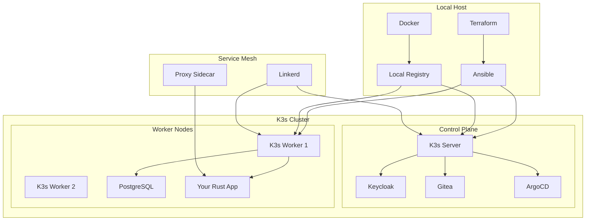
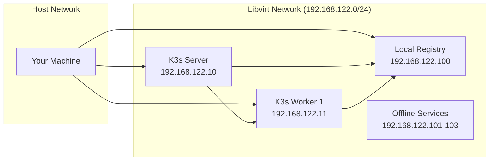
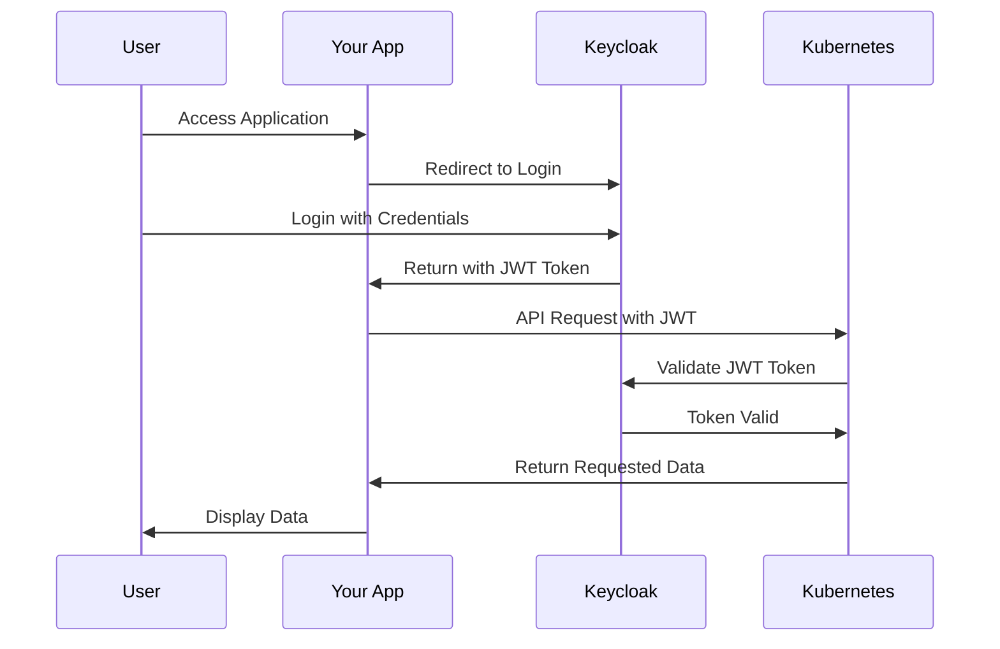
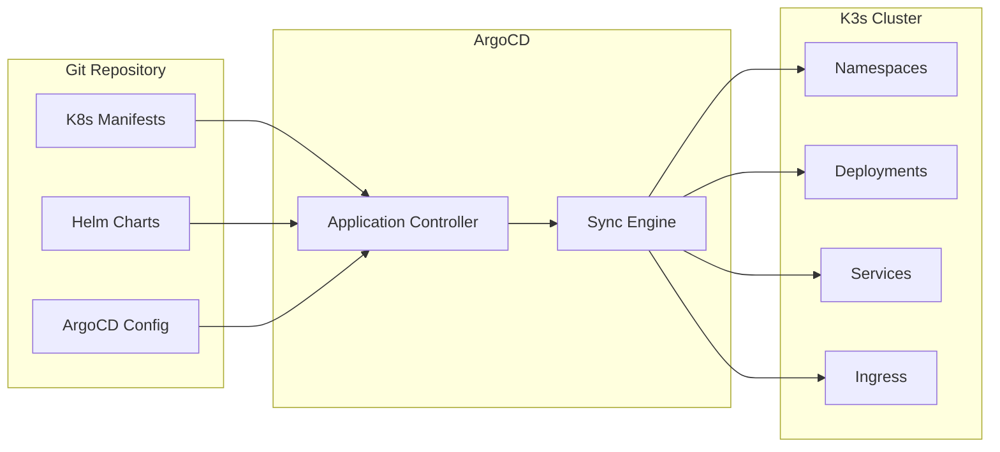
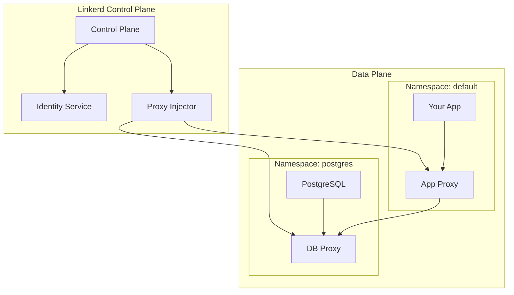
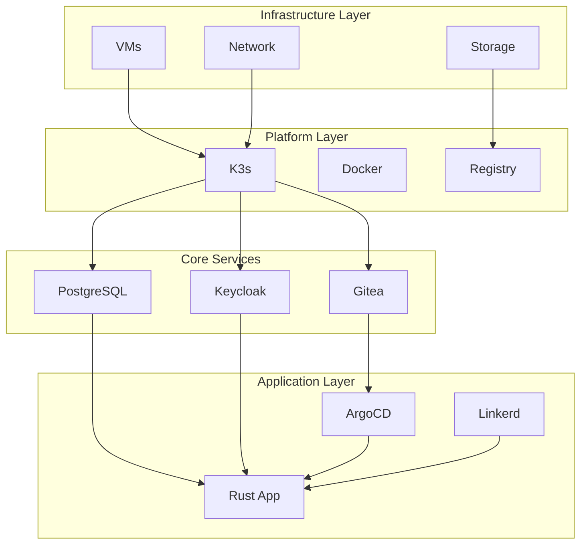
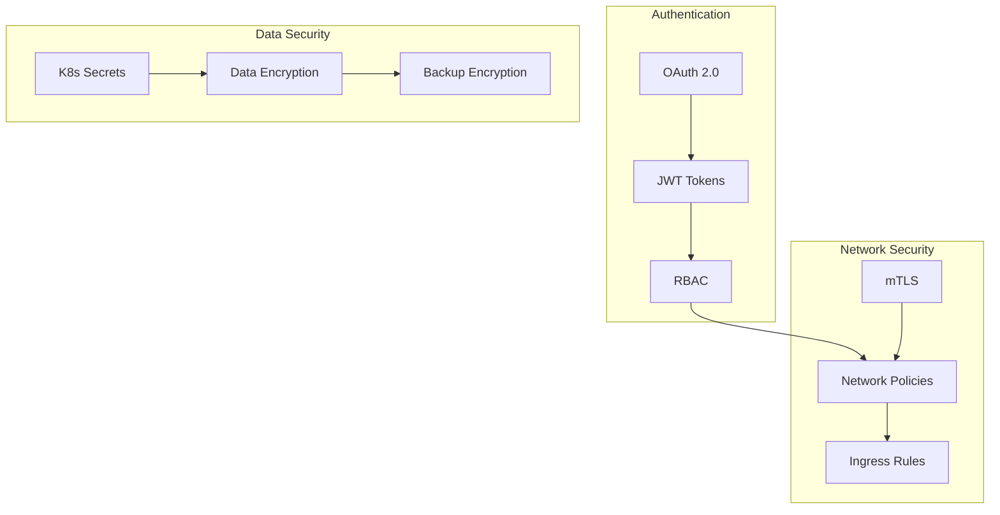
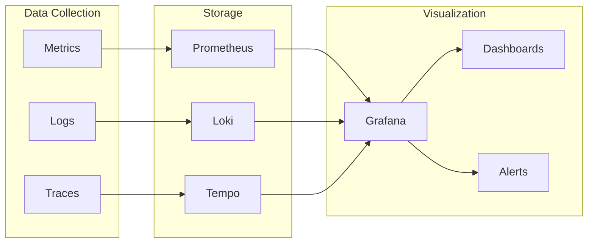

# K3s Lab Architecture

## System Overview

This document describes the architecture of the K3s lab infrastructure, designed to run completely offline with all necessary services for the assignment.

## High-Level Architecture

## Network Architecture

## Authentication Flow

## GitOps Pipeline

## Service Mesh Architecture

## Component Dependencies

## Security Model

## Monitoring and Observability

