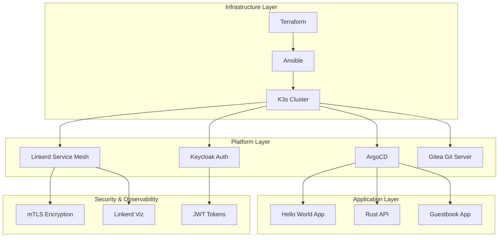
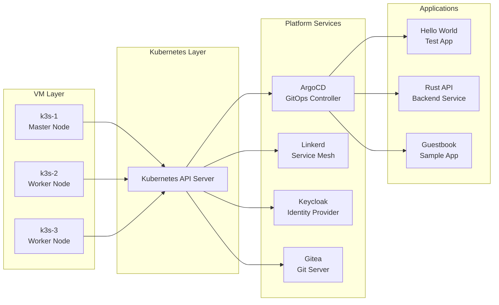
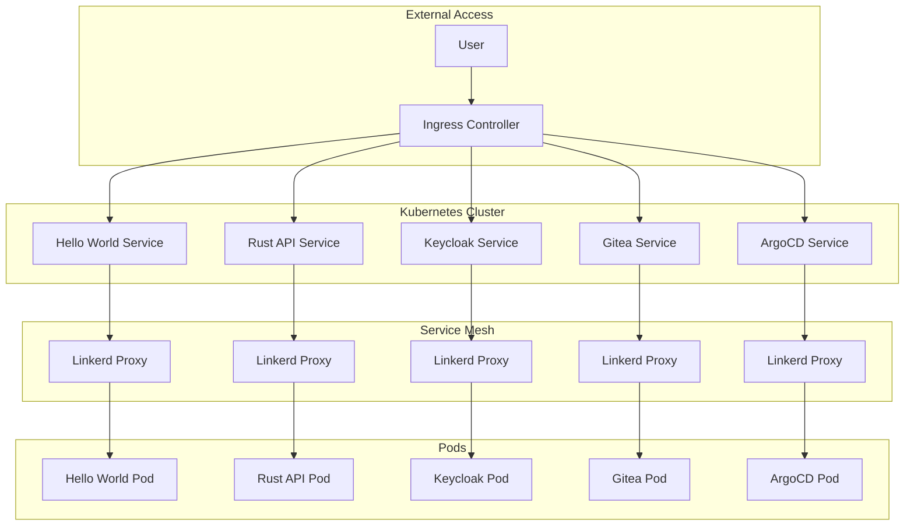
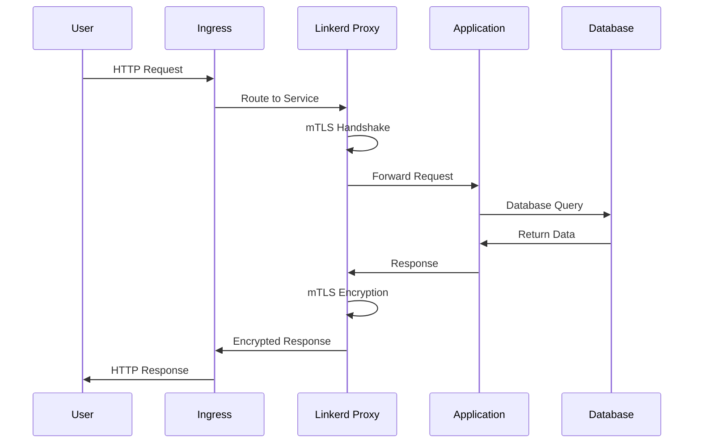
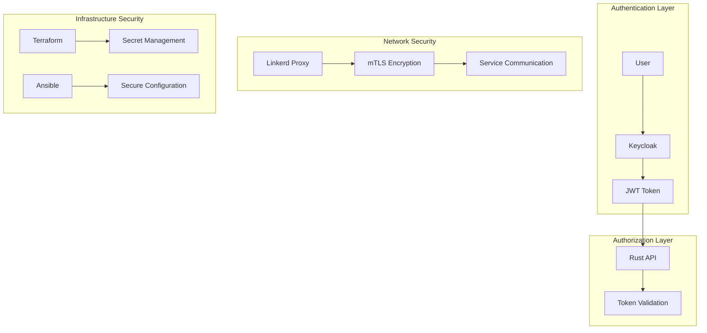
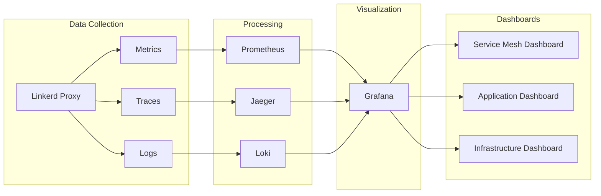

# 🏗️ Architecture Documentation

## System Architecture Overview

## Detailed Component Architecture

## Network Architecture

## Data Flow Architecture

## Security Architecture

## Observability Architecture

