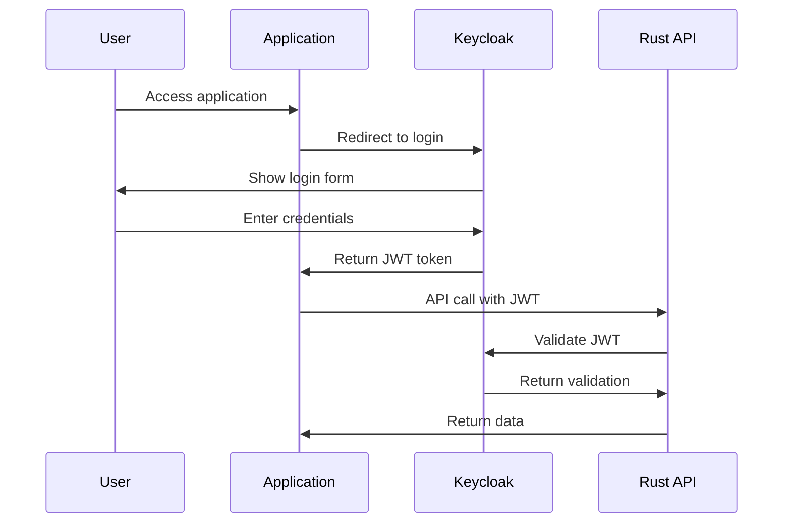
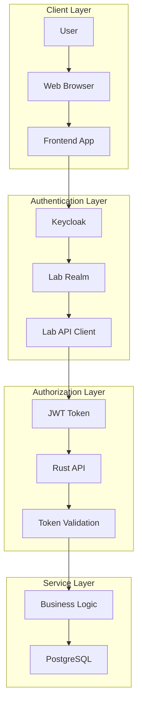
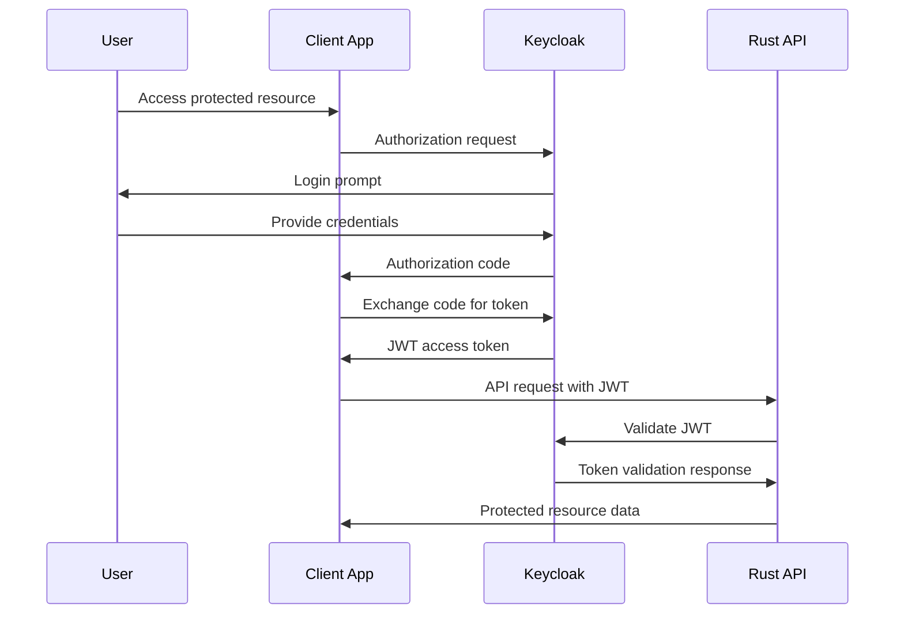
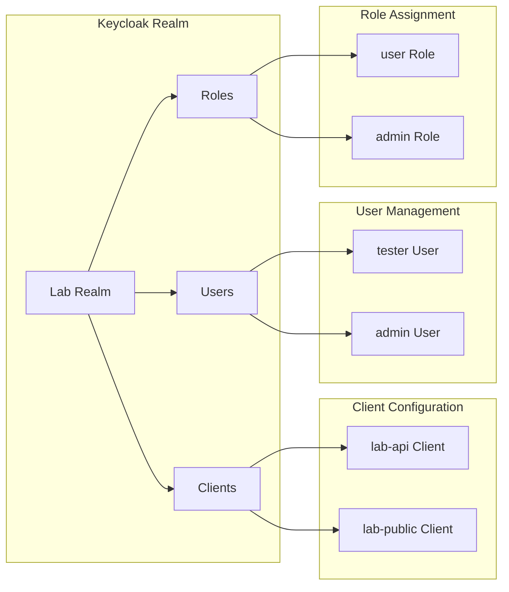
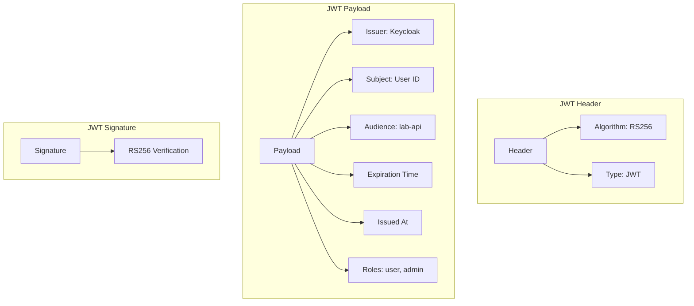
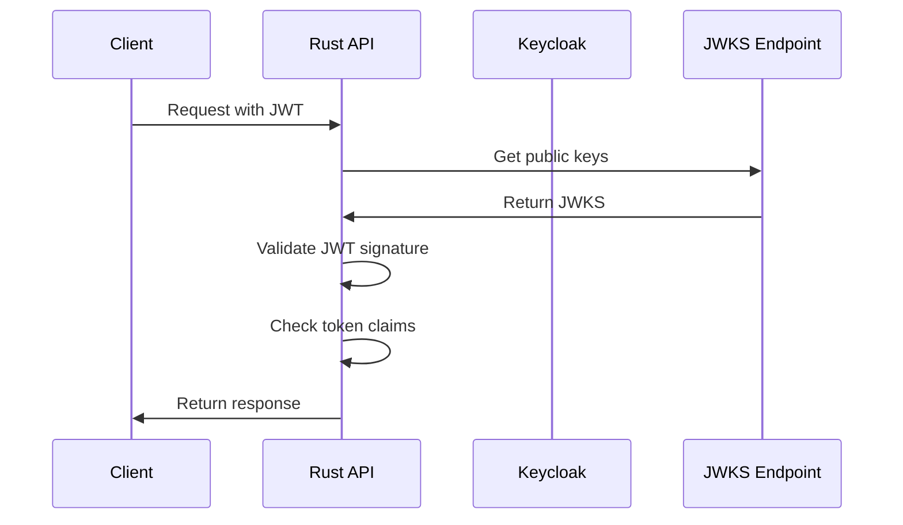
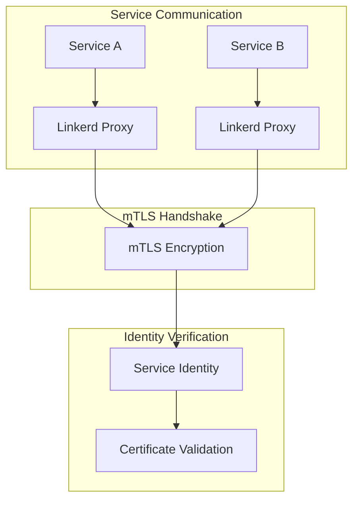
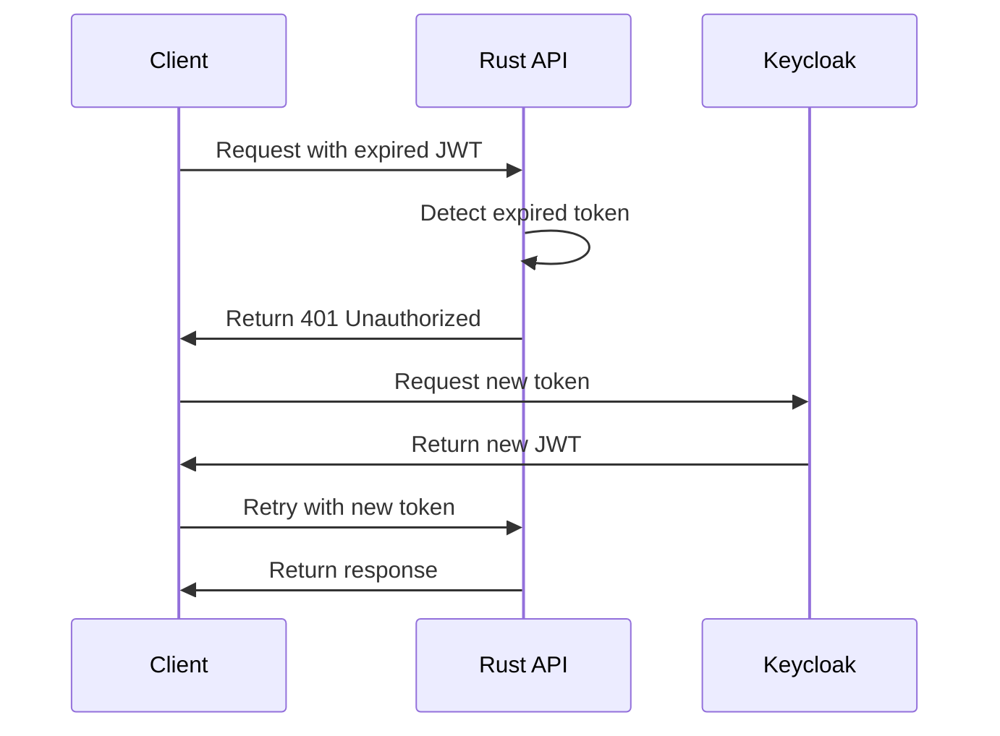
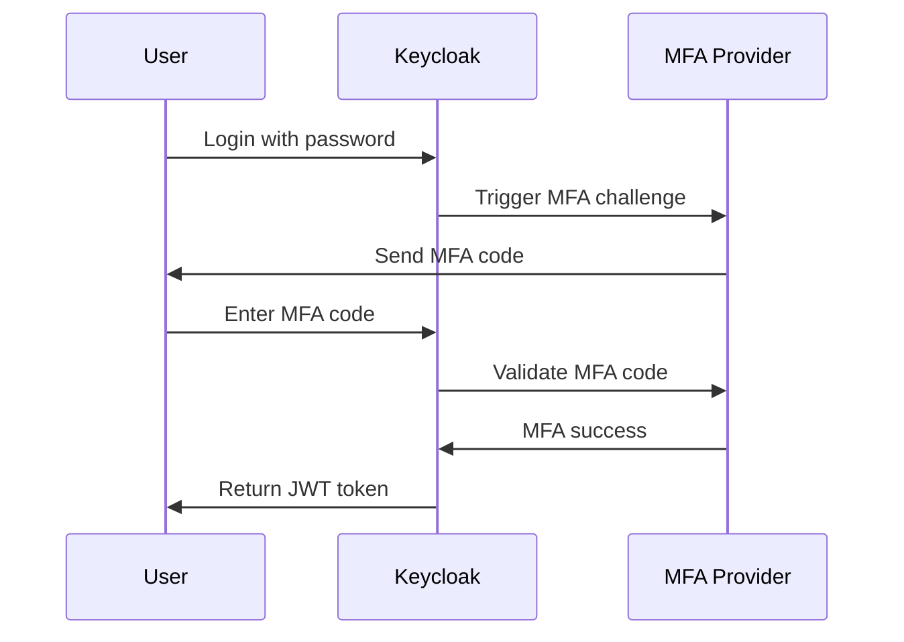
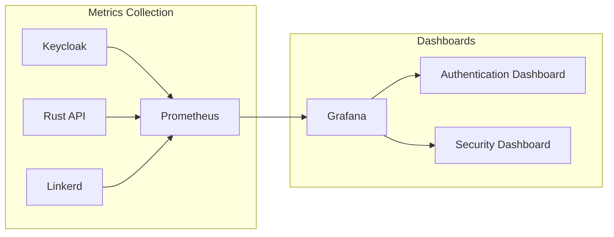

# 🔐 Authentication & Authorization Documentation

## Authentication Flow Overview



## Detailed Authentication Architecture



## OIDC Flow Implementation



## Keycloak Configuration

### Realm Setup



### Client Configuration

```yaml
# Keycloak Client Configuration
clientId: lab-api
clientType: confidential
standardFlowEnabled: true
directAccessGrantsEnabled: true
serviceAccountsEnabled: true
redirectUris:
  - "http://localhost:3000/*"
  - "http://rust-api.local/*"
webOrigins:
  - "http://localhost:3000"
  - "http://rust-api.local"
```

## JWT Token Structure



## Rust API Integration

### JWT Validation Flow



### API Middleware Implementation

```rust
// JWT Validation Middleware
pub async fn jwt_middleware(
    req: ServiceRequest,
    next: Next<()>,
) -> Result<ServiceResponse, Error> {
    let token = extract_token_from_header(&req);
    
    match validate_jwt_token(&token).await {
        Ok(claims) => {
            req.extensions_mut().insert(claims);
            next.call(req).await
        }
        Err(_) => Err(ErrorUnauthorized("Invalid token"))
    }
}
```

## Service Mesh Integration

### mTLS with Authentication



### Linkerd Identity Integration

```yaml
# Service Account with Identity
apiVersion: v1
kind: ServiceAccount
metadata:
  name: rust-api
  namespace: default
  annotations:
    linkerd.io/inject: enabled
```

## Security Policies

### Network Policies

```yaml
apiVersion: networking.k8s.io/v1
kind: NetworkPolicy
metadata:
  name: rust-api-policy
spec:
  podSelector:
    matchLabels:
      app: rust-api
  policyTypes:
  - Ingress
  - Egress
  ingress:
  - from:
    - namespaceSelector:
        matchLabels:
          name: keycloak
    ports:
    - protocol: TCP
      port: 8080
```

### RBAC Configuration

```yaml
apiVersion: rbac.authorization.k8s.io/v1
kind: Role
metadata:
  name: rust-api-role
rules:
- apiGroups: [""]
  resources: ["secrets"]
  verbs: ["get", "list"]
- apiGroups: [""]
  resources: ["configmaps"]
  verbs: ["get", "list"]
```

## Token Refresh Flow



## Multi-Factor Authentication

### MFA Flow



## Security Best Practices

### 1. **Token Management**
- Use short-lived access tokens (15 minutes)
- Implement refresh token rotation
- Store tokens securely (httpOnly cookies)

### 2. **Keycloak Configuration**
- Enable HTTPS only
- Configure proper CORS policies
- Use strong password policies

### 3. **API Security**
- Validate all JWT claims
- Implement rate limiting
- Use HTTPS for all communications

### 4. **Service Mesh Security**
- Enable mTLS for all services
- Use network policies
- Implement service-to-service authentication

## Troubleshooting Authentication

### Common Issues

**Issue**: JWT validation failing
```bash
# Check Keycloak logs
kubectl logs -n keycloak deployment/keycloak

# Verify JWKS endpoint
curl http://keycloak.local/realms/lab/protocol/openid-connect/certs
```

**Issue**: mTLS not working
```bash
# Check Linkerd status
linkerd check

# Verify service identity
kubectl get pods -o wide
```

**Issue**: Token expiration
```bash
# Check token claims
echo $JWT_TOKEN | base64 -d | jq

# Refresh token
curl -X POST http://keycloak.local/realms/lab/protocol/openid-connect/token
```

## Monitoring & Observability

### Authentication Metrics



### Key Metrics

| Metric | Description | Target |
|--------|-------------|---------|
| **Login Success Rate** | Percentage of successful logins | > 99% |
| **Token Validation Time** | JWT validation latency | < 100ms |
| **mTLS Handshake Time** | Service-to-service handshake | < 50ms |
| **Failed Authentication** | Number of failed auth attempts | < 1% |

---

*"Security is not a product, but a process."* 🔒
