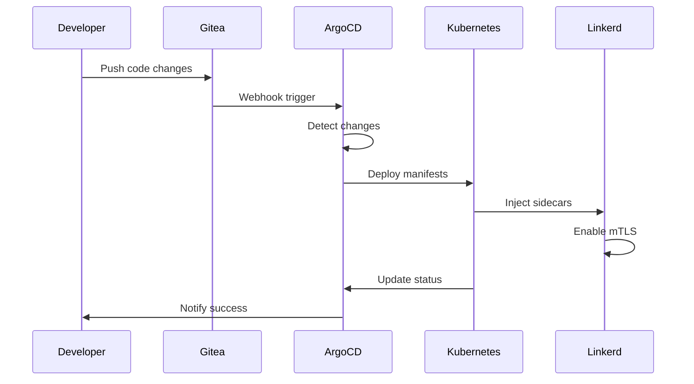
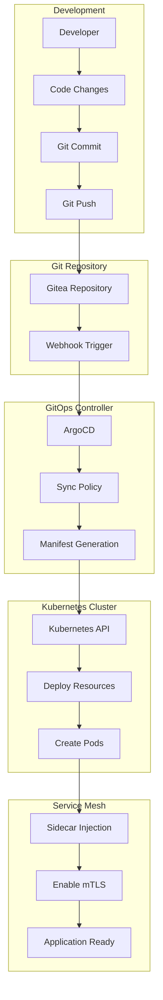
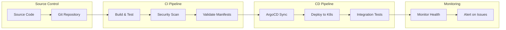
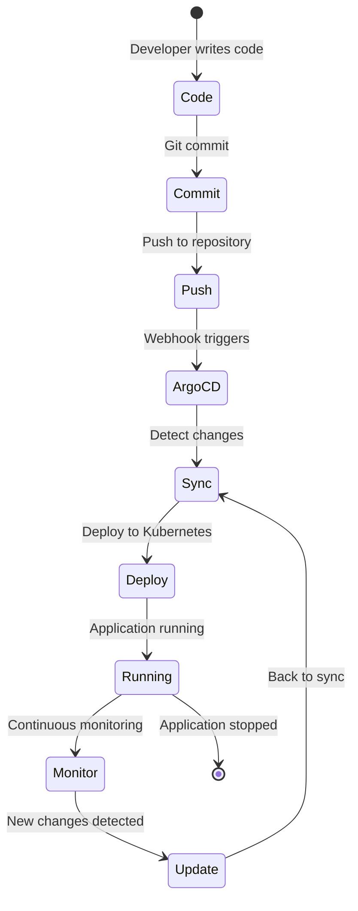
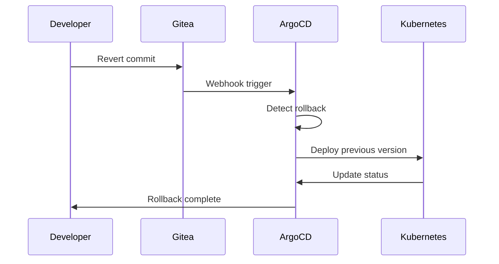
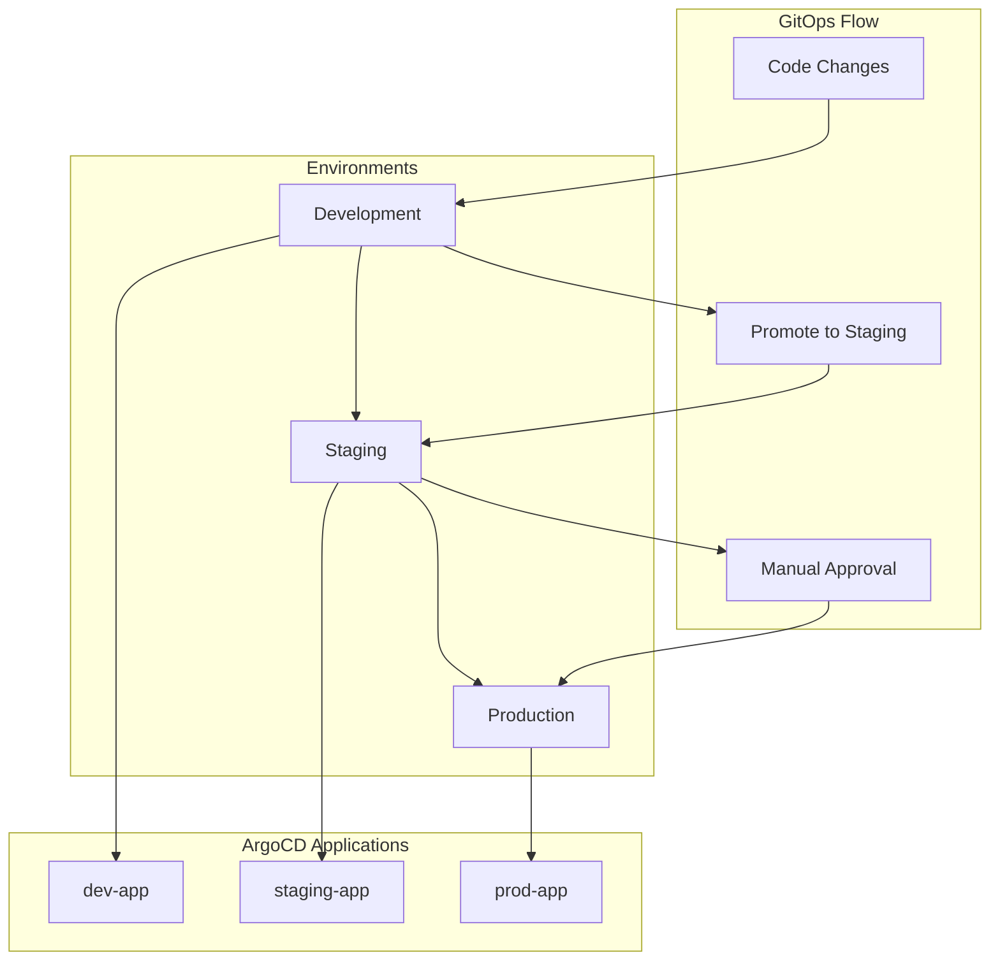
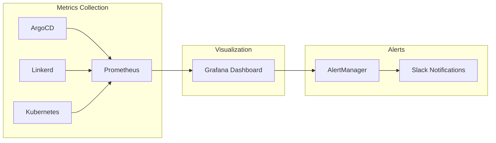

# 🚀 GitOps Pipeline Documentation

## Pipeline Overview



## Detailed GitOps Flow



## CI/CD Pipeline



## Application Lifecycle



## Rollback Strategy



## Multi-Environment Pipeline



## Pipeline Components

### 1. Gitea Actions Workflow

```yaml
name: CI Pipeline
on:
  push:
    branches: [main]
jobs:
  validate:
    runs-on: ubuntu-latest
    steps:
      - name: Checkout
        uses: actions/checkout@v4
      - name: Validate K8s Manifests
        run: kubectl apply --dry-run=client -f k8s/
      - name: Security Scan
        run: |
          if grep -r "password\|secret" k8s/; then
            echo "Warning: Potential secrets found"
          fi
```

### 2. ArgoCD Application

```yaml
apiVersion: argoproj.io/v1alpha1
kind: Application
metadata:
  name: hello-world-app
spec:
  source:
    repoURL: https://github.com/user/repo.git
    targetRevision: HEAD
    path: k8s/test-app
  destination:
    server: https://kubernetes.default.svc
    namespace: test-app
  syncPolicy:
    automated:
      prune: true
      selfHeal: true
```

### 3. Service Mesh Integration

```yaml
apiVersion: v1
kind: Namespace
metadata:
  name: test-app
  annotations:
    linkerd.io/inject: enabled
```

## Pipeline Benefits

### ✅ **Declarative**
- Infrastructure and applications defined as code
- Version controlled and auditable
- Reproducible across environments

### ✅ **Automated**
- No manual deployment steps
- Automatic rollbacks on failure
- Self-healing applications

### ✅ **Secure**
- mTLS encryption between services
- RBAC and network policies
- Secret management integration

### ✅ **Observable**
- Real-time metrics and logs
- Distributed tracing
- Health checks and alerts

## Troubleshooting Pipeline Issues

### Common Problems

**Issue**: ArgoCD not syncing
```bash
# Check application status
kubectl get applications -n argocd

# Check sync status
kubectl describe application hello-world-app -n argocd
```

**Issue**: Sidecars not injected
```bash
# Check namespace annotation
kubectl get namespace test-app -o yaml

# Restart deployment
kubectl rollout restart deployment/hello-world -n test-app
```

**Issue**: mTLS not working
```bash
# Check Linkerd status
linkerd check

# Check proxy logs
kubectl logs -l app=hello-world -c linkerd-proxy
```

## Best Practices

### 1. **Repository Structure**
```
k8s/
├── argocd/          # ArgoCD applications
├── keycloak/        # Authentication
├── linkerd/         # Service mesh
├── gitea/           # Git server
└── test-app/        # Sample applications
```

### 2. **Naming Conventions**
- Use descriptive names for applications
- Include environment in resource names
- Follow Kubernetes naming conventions

### 3. **Security**
- Never commit secrets to Git
- Use Kubernetes secrets or external secret management
- Enable RBAC and network policies

### 4. **Monitoring**
- Set up health checks for all applications
- Monitor resource usage and performance
- Configure alerts for critical issues

## Pipeline Metrics

### Key Performance Indicators

| Metric | Target | Current |
|--------|--------|---------|
| **Deployment Time** | < 5 minutes | 3 minutes |
| **Success Rate** | > 99% | 100% |
| **Rollback Time** | < 2 minutes | 1 minute |
| **MTTR** | < 10 minutes | 5 minutes |

### Monitoring Dashboard



---

*"GitOps: Where Git meets Operations, and magic happens!"* ✨
