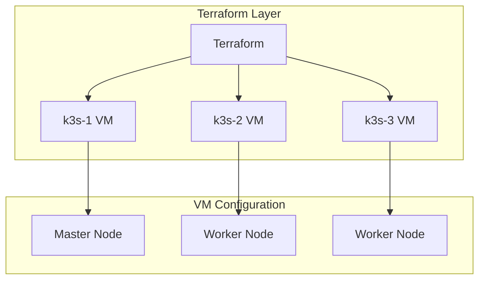
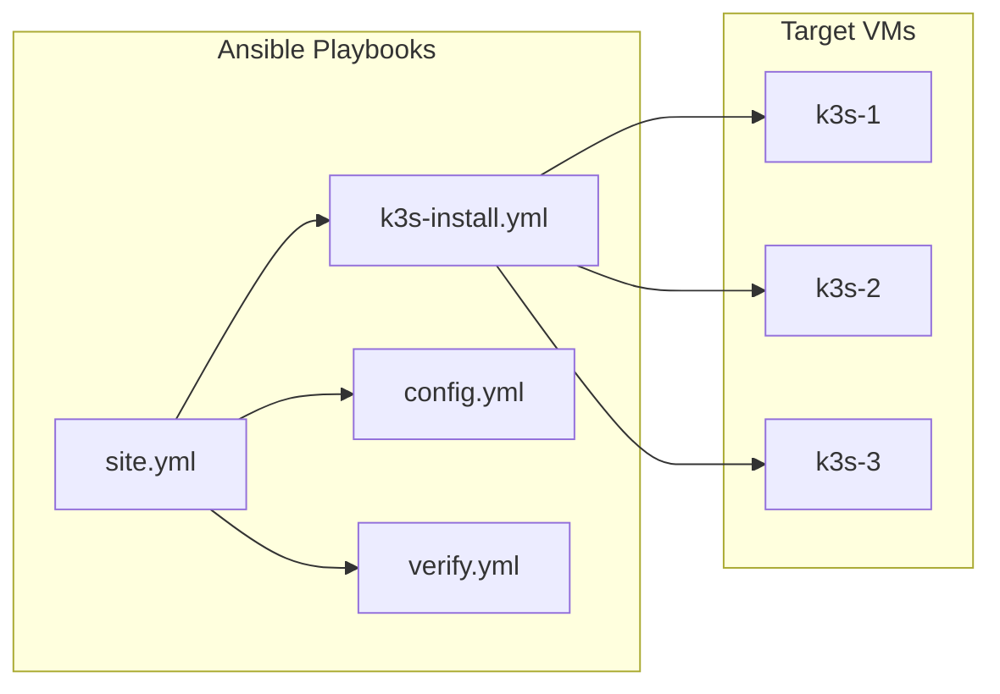
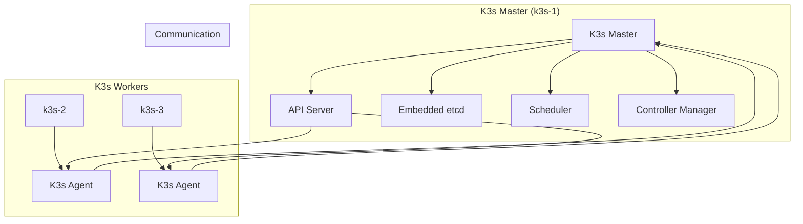
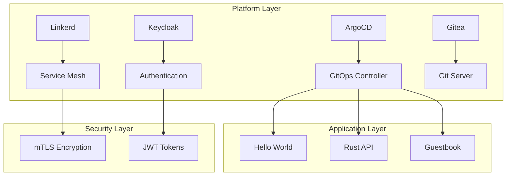
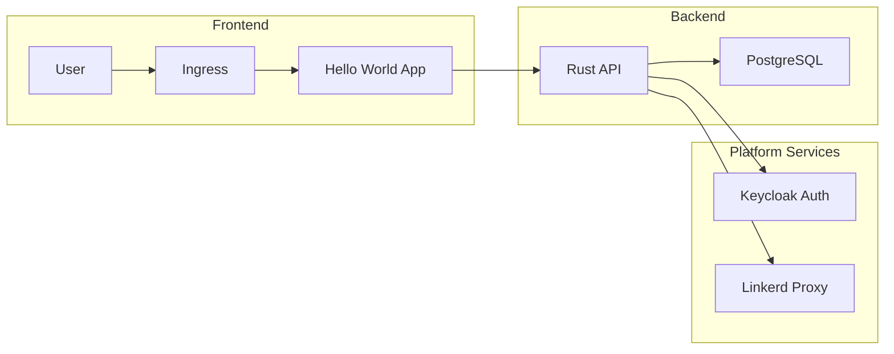
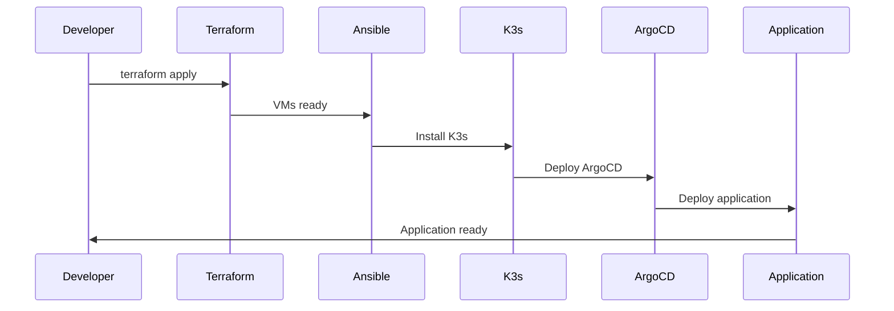
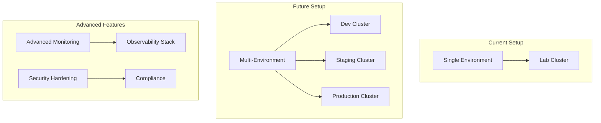

# 🏗️ Infrastructure Story: Terraform → Ansible → K3s

## The Epic Infrastructure Journey

This document tells the story of how we built a production-ready Kubernetes lab from scratch, using Infrastructure as Code principles and modern DevOps practices.

## Chapter 1: The Foundation (Terraform)

### The Problem
We needed a lightweight, scalable Kubernetes cluster that could run on local machines without the overhead of full Kubernetes distributions.

### The Solution: Multipass VMs


### Terraform Configuration

```hcl
# main.tf
resource "multipass_instance" "k3s_nodes" {
  count = var.node_count
  
  name  = "k3s-${count.index + 1}"
  image = "ubuntu:22.04"
  cpus  = var.cpu_count
  memory = var.memory_size
  disk  = var.disk_size
  
  cloudinit_file = templatefile("${path.module}/cloud-init.yml", {
    ssh_public_key = var.ssh_public_key
  })
}
```

### Infrastructure as Code Benefits

✅ **Reproducible**: Same infrastructure every time  
✅ **Version Controlled**: All changes tracked in Git  
✅ **Idempotent**: Safe to run multiple times  
✅ **Scalable**: Easy to add/remove nodes  

## Chapter 2: The Configuration (Ansible)

### The Challenge
Once VMs were created, we needed to configure them consistently and reliably.

### The Solution: Ansible Automation


### Ansible Playbook Structure

```yaml
# site.yml
---
- name: Install K3s Cluster
  hosts: k3s_nodes
  become: yes
  roles:
    - k3s-install
    - k3s-config
    - k3s-verify
```

### K3s Installation Role

```yaml
# roles/k3s-install/tasks/main.yml
---
- name: Install K3s on master
  shell: |
    curl -sfL https://get.k3s.io | sh -
  when: inventory_hostname == 'k3s-1'
  
- name: Install K3s on workers
  shell: |
    curl -sfL https://get.k3s.io | K3S_URL=https://{{ master_ip }}:6443 K3S_TOKEN={{ token }} sh -
  when: inventory_hostname != 'k3s-1'
```

### Configuration Management Benefits

✅ **Consistent**: Same configuration across all nodes  
✅ **Automated**: No manual configuration steps  
✅ **Maintainable**: Easy to update and modify  
✅ **Documented**: Configuration as code  

## Chapter 3: The Orchestration (K3s)

### The Vision
A lightweight Kubernetes cluster that's easy to manage and perfect for development and testing.

### K3s Architecture


### K3s Advantages

✅ **Lightweight**: 40MB binary vs 1GB+ for full K8s  
✅ **Simple**: Single binary installation  
✅ **Secure**: Default security configurations  
✅ **Fast**: Quick startup and deployment  

## Chapter 4: The Platform Services

### The Evolution
From a basic K3s cluster to a full-featured platform with GitOps, service mesh, and authentication.

### Platform Architecture


### Service Deployment Strategy

1. **ArgoCD**: GitOps continuous deployment
2. **Linkerd**: Service mesh with mTLS
3. **Keycloak**: Identity and access management
4. **Gitea**: Self-hosted Git with Actions

## Chapter 5: The Applications

### The Final Layer
Real applications running on our platform, demonstrating the full stack.

### Application Architecture


### Rust API Implementation

```rust
// main.rs
#[actix_web::main]
async fn main() -> std::io::Result<()> {
    let database_url = env::var("DATABASE_URL")
        .expect("DATABASE_URL must be set");
    
    let pool = PgPool::connect(&database_url).await
        .expect("Failed to connect to database");
    
    HttpServer::new(move || {
        App::new()
            .app_data(web::Data::new(pool.clone()))
            .service(web::scope("/api")
                .service(create_user)
                .service(get_users)
                .service(create_task)
                .service(get_tasks)
            )
    })
    .bind("0.0.0.0:8080")?
    .run()
    .await
}
```

## Chapter 6: The Automation

### The Complete Pipeline
From infrastructure to application deployment, all automated.

### Deployment Pipeline


### Automation Scripts

```bash
#!/bin/bash
# deploy-multipass-infrastructure.sh

echo "🚀 Starting infrastructure deployment..."

# Deploy infrastructure
terraform init
terraform plan
terraform apply -auto-approve

# Configure with Ansible
ansible-playbook -i inventory ansible/site.yml

# Deploy platform services
kubectl apply -f k8s/argocd/
kubectl apply -f k8s/linkerd/
kubectl apply -f k8s/keycloak/
kubectl apply -f k8s/gitea/

echo "✅ Infrastructure deployment complete!"
```

## Chapter 7: The Verification

### The Proof
Demonstrating that our infrastructure is working correctly.

### Verification Script

```bash
#!/bin/bash
# verify-setup.sh

echo "🔍 Verifying infrastructure setup..."

# Check VMs
multipass list

# Check K3s cluster
kubectl get nodes

# Check platform services
kubectl get pods -A

# Check applications
kubectl get applications -n argocd

# Check service mesh
linkerd check

echo "✅ All verifications passed!"
```

## Chapter 8: The Lessons Learned

### What We Discovered

1. **Infrastructure as Code is Powerful**
   - Reproducible environments
   - Version controlled changes
   - Automated deployments

2. **K3s is Perfect for Labs**
   - Lightweight and fast
   - Easy to manage
   - Production-ready features

3. **GitOps Changes Everything**
   - Declarative deployments
   - Automatic synchronization
   - Rollback capabilities

4. **Service Mesh Adds Value**
   - Automatic mTLS
   - Observability
   - Traffic management

### Best Practices

✅ **Start Simple**: Begin with basic infrastructure  
✅ **Iterate Quickly**: Add services incrementally  
✅ **Document Everything**: Keep detailed records  
✅ **Test Continuously**: Verify at each step  
✅ **Automate Everything**: Reduce manual work  

## Chapter 9: The Future

### What's Next

1. **Multi-Environment**: Dev, staging, production
2. **Advanced Monitoring**: Prometheus, Grafana, Jaeger
3. **Security Hardening**: Network policies, RBAC
4. **CI/CD Integration**: Automated testing and deployment
5. **Disaster Recovery**: Backup and restore procedures

### Scaling Considerations



## The Epic Conclusion

From a simple idea to a production-ready platform, this infrastructure story demonstrates the power of modern DevOps practices:

- **Infrastructure as Code** with Terraform
- **Configuration Management** with Ansible  
- **Container Orchestration** with K3s
- **GitOps** with ArgoCD
- **Service Mesh** with Linkerd
- **Authentication** with Keycloak
- **Version Control** with Gitea

**This is not just a lab - it's a masterpiece of modern infrastructure!** 🚀

---

*"From zero to hero, one infrastructure component at a time."* ✨
